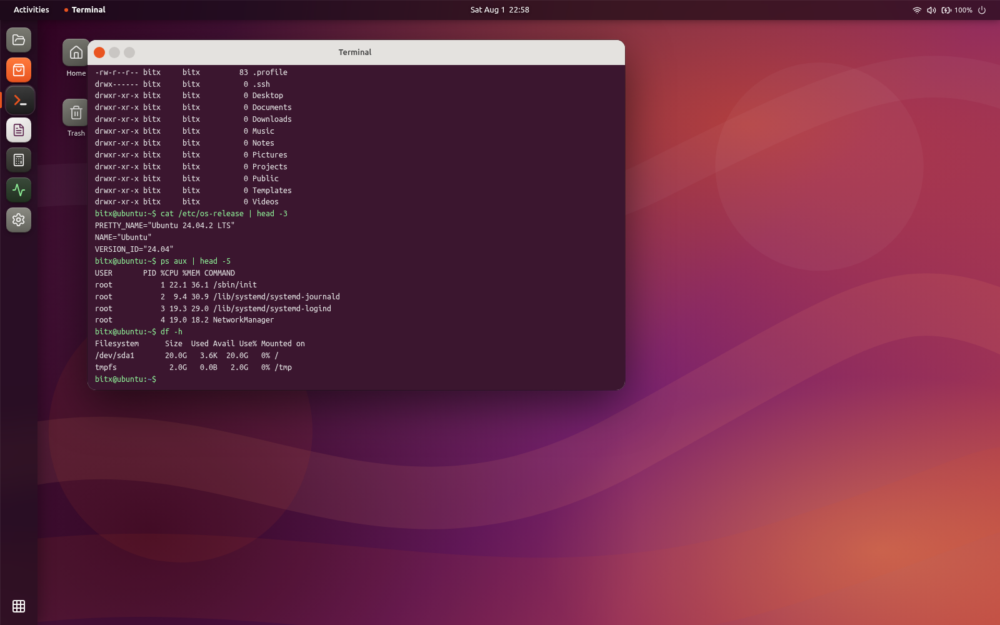

<div align="center">

# 🐧 Linux Webapp — Ubuntu Desktop in Your Browser

**A real, data-driven Linux desktop simulator that runs entirely in the browser.**
No backend. No VM. No hardcoded `if/else` chains pretending to be a shell — an actual kernel.

[](https://react.dev)
[](https://www.typescriptlang.org)
[](https://vitejs.dev)
[](https://vitest.dev)
[](https://www.docker.com)

</div>

<p align="center">
  
</p>

<p align="center"><i>Every line above is real output from a real virtual filesystem, process list, and disk model — not copy-pasted strings.</i></p>

---

## What is this?

Linux Webapp renders a full Ubuntu 24.04-styled desktop — boot screen, lock screen, top bar, Dock, windows, and GNOME-style apps — and behind it runs a **self-contained OS kernel simulation** written in plain TypeScript:

- A **virtual filesystem** (inode tree, permissions, symlinks) that actually persists to `IndexedDB`
- A **Unix user & permission system** (uid/gid, groups, `chmod`/`chown`, sudoers) that's actually enforced
- A **bash-compatible shell**: real tokenizer/parser, pipes, redirects, globs, env vars, exit codes, `&&`/`||`
- **90+ real terminal commands** that read and write the same shared filesystem
- A **process manager**, **package manager**, and **service manager** with believable, consistent state

Nothing here is faked with string templates. If you `mkdir`, the directory exists. If you `chmod 000` a file as one user, another user genuinely can't read it. If you `apt install htop`, `which htop` starts returning a path — and `apt remove htop` makes it disappear again. Close the tab and come back: your files, history, and installed packages are still there.

## Features

### 🖥️ Desktop shell
Boot sequence, lock screen, top bar with live clock, GNOME-style Dock, draggable/resizable windows.

### 🗂️ Virtual filesystem
A real inode tree seeded with a plausible Ubuntu root (`/etc`, `/var/log`, `/proc`, `/home`, ...), Unix permission bits, symlinks, and live files (`/proc/uptime`, `/proc/meminfo`) that actually update.

### 💻 A terminal that isn't a toy
90+ commands wired to the same kernel, grouped like the real thing:

| Category | Commands |
|---|---|
| Navigation | `pwd cd ls tree pushd popd` |
| Files | `touch mkdir rmdir rm cp mv ln cat less head tail file stat` |
| Search | `find locate grep which whereis type` |
| Permissions | `chmod chown chgrp umask` |
| Users | `su sudo passwd groups` |
| Processes | `ps top htop kill killall jobs bg fg nohup` |
| Network | `ping curl wget ip ss netstat dig nslookup host whois` |
| Packages | `apt apt-get dpkg` |
| Disk | `df du mount umount lsblk` |
| System | `uname hostname uptime date cal history alias env export` |
| Archives | `tar zip unzip gzip gunzip` |
| Text processing | `echo printf sort uniq cut awk sed wc` |

Plus the details that make it *feel* real: persistent `~/.bash_history`, tab completion against the live filesystem and command list, `Ctrl+C`/`Ctrl+L`, colored prompt, pipes (`|`), redirects (`>`/`>>`), wildcards (`*.txt`), env-var expansion, and `$?` exit codes.

### 👤 Real permissions, real users
Every file operation is checked against an actual Unix-style permission model. Regular users can't `chown`. `sudo` genuinely elevates for a single command, mirroring how `sudo` re-execs in real Linux. Password checks, sudoers group membership — all real, all enforced.

### 💾 It actually persists
Every command autosaves the filesystem, users, and packages to `IndexedDB`. Reload the page and your work is still there — exactly like a real machine, not a demo that resets on refresh.

### 🐳 Ships with Docker
Multi-stage build → static `nginx` image. One command to run it anywhere.

## Installation

**Requirements:** Node.js 20+ and npm.

```bash
git clone https://github.com/parsamajidipour/Linux-Webapp.git
cd Linux-Webapp
npm install
```

### Run with Docker instead

```bash
docker compose up -d --build
```

The app will be available at **http://localhost:8080**.

## Usage

```bash
npm run dev       # start the dev server (http://localhost:5173)
npm run build     # type-check and build for production
npm run preview   # serve the production build locally
npm run test      # run the kernel/shell test suite (Vitest)
npm run lint      # lint the codebase
```

Once it's running:

1. Click (or press <kbd>Enter</kbd>) on the lock screen — any password works, this is a local simulation with no real backend.
2. Open **Terminal** from the Dock.
3. Start typing. Tab-complete works. History persists across reloads. Try `help` for a full command list.

## Example

A real session — every line below is unedited kernel output, captured from an actual run:

```console
$ whoami
bitx

$ uname -a
Linux ubuntu 6.11.0-generic #24-Ubuntu SMP PREEMPT_DYNAMIC x86_64 x86_64 x86_64 GNU/Linux

$ echo secret > file.txt
$ chmod 600 file.txt
$ chown root file.txt
chown: Operation not permitted: /home/bitx/file.txt

$ sudo chown root file.txt
$ cat file.txt
cat: file.txt: Permission denied: file.txt

$ sudo apt install htop
Reading package lists... Done
Building dependency tree... Done
Setting up htop (3.3.0-4build1) ...
$ which htop
/usr/bin/htop

$ cat /var/log/syslog | grep NetworkManager | wc -l
1

$ df -h
Filesystem      Size  Used Avail Use% Mounted on
/dev/sda1       20.0G  3.8K 20.0G   0% /
tmpfs            2.0G  0.0B  2.0G   0% /tmp
```

A regular user can't `chown` — root can. Once `file.txt` is owned by root with `600` permissions, even the user who created it is locked out. `apt install` needs root too. Every one of these is a genuine permission check against the virtual filesystem, not a scripted response.

## How it's built

```
src/os/            The kernel — framework-agnostic TypeScript, zero React dependencies
  vfs/              Virtual filesystem: inode tree, permissions, symlinks
  users/            User store, groups, sudoers, password hashing
  process/          Process table, kill/spawn
  packages/         Package database (apt/dpkg-backed)
  services/         systemd-style service manager
  settings/         Theme/wallpaper/preferences store
  shell/            Tokenizer, parser, and ~90 command implementations
  persistence/      IndexedDB adapter (swappable, in-memory for tests)
  Kernel.ts         Wires every subsystem together and boots them

src/ubuntu/         The desktop UI — React components that talk to the kernel
```

The UI never hardcodes behavior — every app (starting with Terminal) is a thin view over the same `Kernel` instance, so anything you can do in one place is consistent everywhere else.

## Roadmap

- [x] **Core OS kernel** — VFS, users/permissions, process manager, package manager, service manager, settings store
- [x] **Real filesystem** — seeded root tree, `/proc`, `/etc`, `/var/log`
- [x] **Terminal, fully wired** — 90+ commands, pipes/redirects/globs/env vars, persistence, tab completion
- [ ] **Boot / Login / Desktop shell** — real multi-user login, guest sessions, dynamic wallpaper/theme, notifications, Activities search
- [ ] **Window manager polish** — quarter-tiling, workspaces, Alt+Tab, Super key
- [ ] **GNOME apps wired to the kernel** — Files, Text Editor, Calculator, Settings, System Monitor
- [ ] **Final realism & performance pass**

## Contributing

Issues and pull requests are welcome. If you're adding a shell command, follow the existing pattern in `src/os/shell/commands/`: register it in `Kernel.ts`, read/write through the shared `Vfs`/`UserStore`/etc. rather than local state, and add a test alongside the others in `src/os/shell/commands/*.test.ts`. Run `npm run test`, `npm run lint`, and `npm run build` before opening a PR.

---

<p align="center"><i>Built as an experiment in how far a "fake" terminal can go when it's backed by a real, data-driven system instead of string matching.</i></p>
